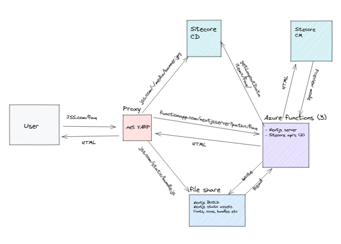

Welcome to the Next.js on Azure repository. Within this repository we host a set of packages that provide a headstart for building the following type of applications:

- Basic custom web sites built on top of Next.js, running on Azure
- Sitecore JSS based website built on top of Next.js, running on Azure

## Getting started

1. Clone repository
2. `lerna bootstrap` (run `npm i lerna -g` if lerna not installed)

To run the **sample custom web site** built on top of Next.js:
1. `cd packages`
2. `cd basic-nextjs-example`
3. `npm run dev`
4. open browser on http://localhost:3000
    
To run the **sample Sitecore JSS based website** built on top of Next.js:
1. `cd packages`
2. `cd jss-nextjs-app`
3. `npm start` (this starts the sample Sitecore JSS website in **disconnected** mode, so no running Sitecore needed)
4. open browser on http://localhost:3000

# The purpose of this repository
## Why Next.js on Azure?
[Next.js](https://nextjs.org/) is a framework for building websites.

> Next.js gives you the best developer experience with all the features you need for production: hybrid static & server rendering, TypeScript support, smart bundling, route pre-fetching, and more. No config needed.

Next.js is developed by [Vercel](https://vercel.com/), and optimized for hosting on the Vercel platform. At Macaw we build most of our solutions on Azure, and our customers expect the website to run on Azure as well. With azure we know the exact costs for website hosting. With Vercel the pricing model is less clear. See for example [this post](https://www.reddit.com/r/nextjs/comments/ikr8jv/understanding_optimizing_nextjs_usage_on_vercel/) on Reddit.

This is why we researched how to run Next.js most optimally on Azure, including the support of Incremental Server-Side Rendering (ISR). The results of this research can be found in this repository. 
Pages only need rerendering by the web server when the page in the CDN is expired. We found that only the Microsoft CDN supports the expiration headers of Next.js as we expected it to work. 

To host Next.js on Azure we have chosen to use an Azure Function to (pre)render the Sitecore pages. Besides the rendering, the static assets also have to be served (e.g. _next/static/js/791.bundle.js). We had another Azure Function in place that streamed these files back to the user. That was done with **Azure Function proxies**, that solution is not viable anymore because the proxies are not supported in [https://learn.microsoft.com/en-us/azure/azure-functions/functions-proxies#migration](Azure Functions 4).

To fix this, we have chosen to put another type of Proxy in front of the Azure Function, a .NET application using [YARP](https://microsoft.github.io/reverse-proxy/). This application is mainly run on configuration, which makes it ideal to run in various environments. We don't need an Azure Function anymore to stream static files, the .NET application mounts the File share that contains the Next.js build. 

## Three headstarts for Next.js
Within Macaw we identify four headstart projects for external-facing websites with Next.js. All these headstarts have in common that they:
- are built in React and TypeScript
- support server-side rendering
- are built for SEO

# Available packages
The following packages are available:

React UI components:
- [`ui-components`](packages/ui-components/README.md) - a core set of React UI components and styling to be used in custom-built websites
  
Next.js basic example:
- [`basic-nextjs-azure-functions`](packages/basic-nextjs-azure-functions/README.md) - the Next.js website running from an Azure function for the basic website example
- [`basic-nextjs-example`](packages/basic-nextjs-example/README.md) - the Next.js code for the basic website example

Next.js Sitecore Headless example with JSS:
- [`jss-nextjs-app-azure-functions`](packages/jss-nextjs-app-azure-functions/README.md) - the Next.js website running from an Azure function for the Sitecore headless JSS example
- [`basic-nextjs-app`](packages/jss-nextjs-app/README.md) - the Next.js code for the Sitecore headless JSS example

.NET app with a YARP proxy to replace the deprecated Azure Function proxies
- [`.NET Yarp proxy`](YarpProxy)